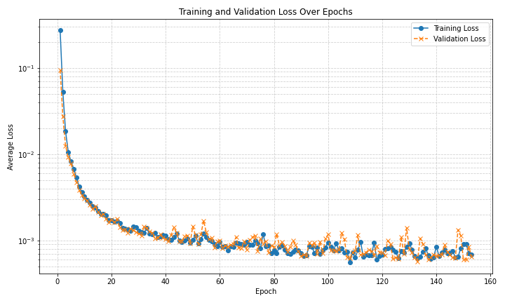
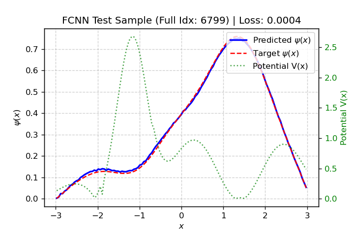
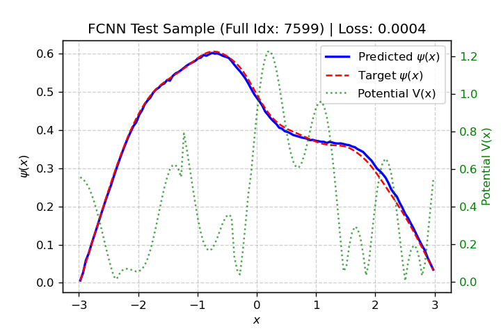

# Schrodinger Equation Solver using FCNN (PyTorch)

This project uses a Fully Connected Neural Network (FCNN) implemented in PyTorch to predict the ground state wavefunction of the 1D Schrodinger equation based on the potential.

## The Equation

The equation is typically written as:


$$ \hat{H} \psi(x) = E \psi(x) $$


For a single non-relativistic particle in one dimension moving in a potential `V(x)`, the Hamiltonian operator `\hat{H}` is:


$$ \hat{H} = -\frac{\hbar^2}{2m} \frac{d^2}{dx^2} + V(x) $$


So the full equation becomes:


$$ \left( -\frac{\hbar^2}{2m} \frac{d^2}{dx^2} + V(x) \right) \psi(x) = E \psi(x) $$


## Visualization
### Training and Validation Loss



### Comparison of prediction and numerical solution in test sets





## Features

*   FCNN model built with PyTorch (`nn.Linear` and `nn.Softplus`).
*   Loads potential and wavefunction data from a CSV file.
*   Splits data into training (60%), validation (20%), and testing (20%) sets.
*   Trains the model using Adam optimizer with configurable learning rate and weight decay.
*   Implements early stopping based on validation loss to prevent overfitting.
*   Calculates and plots both training and validation loss curves (saved to `outputs/`).
*   Evaluates the final model on the test set.
*   Saves the best performing model state (`_best.pth`) or the final model state (`_final.pth`) to `outputs/`.
*   Plots example predictions against the ground truth for the test set, including the input potential (saved to `outputs/`).


## Project Structure

```
├── .gitignore
├── data/
│   └── NN_valid_data_schrodinger_1D_sol-Rx=3-Nx=128-num_data=25000-size_data=129.csv  # Example data file
├── notebooks/
│   └── schrodinger_FCNN_pytorch.ipynb  # Jupyter notebook version
├── outputs/                  # Directory for saved models and plots (created automatically)
├── schrodinger_FCNN_pytorch.py  # Main Python script
└── README.md
```

## Requirements

*   Python 3.x
*   PyTorch
*   NumPy
*   Matplotlib

It's recommended to use a virtual environment:

```bash
python -m venv venv
source venv/bin/activate  # On Windows use `venv\Scripts\activate`
pip install torch numpy matplotlib
```

## Usage

### 1. Data Preparation

*   Place your training data CSV file (e.g., `NN_valid_data_schrodinger_1D_sol-Rx=3-Nx=128-num_data=25000-size_data=129.csv`) inside the `data/` directory.
*   Ensure the filename parameters (Rx, Nx, num_data, size_data) match those expected by the script/notebook.

### 2. Running the Python Script

*   Modify the `PARAMS` dictionary and `DATA_DIRECTORY` variable within the `if __name__ == "__main__":` block in `schrodinger_FCNN_pytorch.py` to match your dataset and desired configuration.
*   Run the script from the project root directory:

```bash
python schrodinger_FCNN_pytorch.py
```

### 3. Using the Jupyter Notebook

*   Ensure the `data` directory with the CSV file is present in the project root.
*   Start Jupyter Lab or Jupyter Notebook from the project root directory:

```bash
jupyter lab
# or
jupyter notebook
```

*   Open the `notebooks/schrodinger_FCNN_pytorch.ipynb` file.
*   Modify the `PARAMS` dictionary and `DATA_DIRECTORY`/`OUTPUT_DIRECTORY` variables in the configuration cell.
*   Run the cells sequentially.

## Output

*   Trained model files (`.pth`) will be saved in the `outputs/` directory.
*   Loss plots and prediction plots (`.png`) will be saved in the `outputs/` directory.
